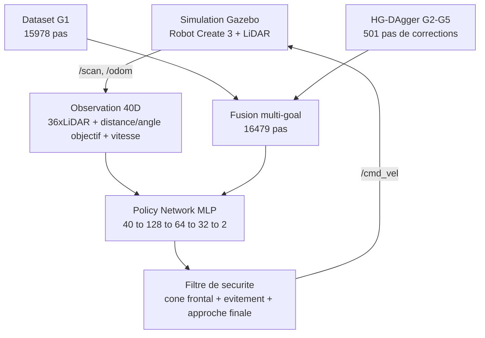
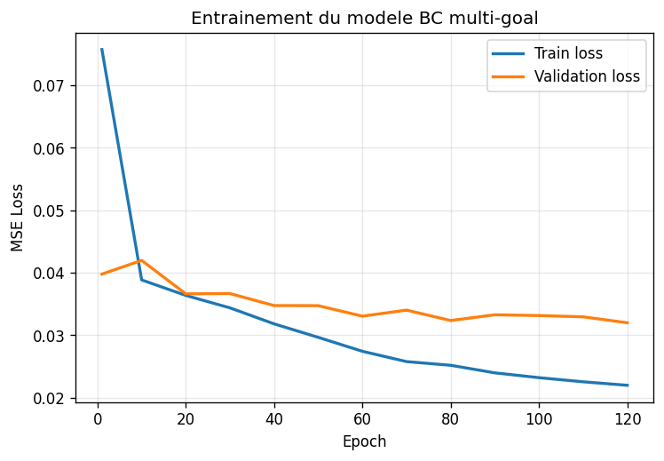
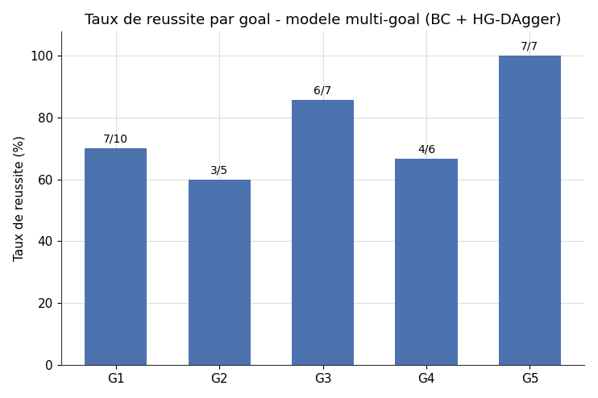
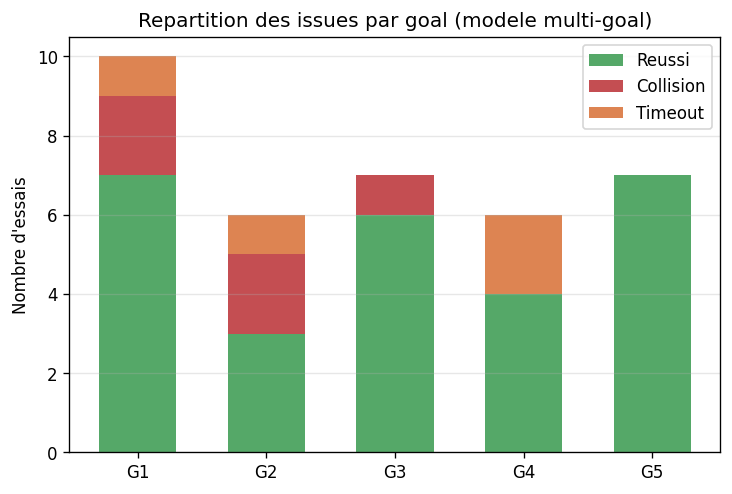

# 🚀 Navigation Autonome par Imitation Learning — Multi-Goal

[](https://docs.ros.org/en/humble/)
[](https://classic.gazebosim.org/)
[](https://pytorch.org/)
[](https://www.python.org/)

---

## 📖 Présentation du projet

Ce projet implémente un système de **navigation autonome multi-objectif** pour un robot **iRobot Create 3** en utilisant l'**Apprentissage par Imitation (Imitation Learning)**.

Le robot apprend à naviguer vers **5 objectifs distincts** dans un environnement simulé sous **ROS 2** et **Gazebo**, à partir d'un dataset de démonstrations par Behavioral Cloning, affiné par des sessions interactives de **HG-DAgger** ciblées sur chaque nouvel objectif.


### 🎯 Objectifs

1. Apprendre une politique de navigation à partir de démonstrations humaines
2. Naviguer de manière autonome dans un couloir en L avec obstacles
3. Généraliser à **5 objectifs différents**, pas un seul point fixe
4. Mesurer l'apport de HG-DAgger par rapport au Behavioral Cloning seul

---

## 🏗️ Pipeline global



---

## 📸 Résultats

### Courbe d'apprentissage (modèle multi-goal)



### Taux de réussite par objectif



| Goal | Coordonnées | Pas DAgger | Essais | Taux de réussite |
|------|-------------|------------|--------|-------------------|
| G1   | (5.5, 1.5)  | — (dataset initial) | 10 | 70.0 % |
| G2   | (6.5, -2.0) | 176 | 6 | 50.0 % |
| G3   | (1.0, 2.0)  | 74  | 7 | 85.7 % |
| G4   | (6.0, 0.0)  | 197 | 6 | 66.7 % |
| G5   | (0.5, -2.0) | 54  | 7 | **100.0 %** |
| **Moyenne** | — | — | **36** | **75.0 %** |

### Impact de HG-DAgger (Baseline vs Multi-goal, objectif G2)


| Modèle | Essais | Taux de réussite | Comportement observé |
|--------|--------|-------------------|-----------------------|
| BC seul (jamais vu G2) | 6 | **0 %** | Timeout systématique, errance sans collision |
| BC + HG-DAgger | 6 | **50 %** | Réussite dans la moitié des essais |

### Répartition des issues par goal



---

## 🎬 Vidéo de démonstration

▶️ [**Navigation multi-goal**](media/videos/multi_goal.mp4)

---

## ⚠️ Limites connues

- **Minima locaux** : le filtre de sécurité réactif peut osciller dans les passages étroits sans dégager complètement l'obstacle.
- **Détection frontale uniquement** : les collisions latérales en virage ne sont pas couvertes par le cône de sécurité actuel.
- **Déséquilibre du dataset** : G2–G5 ne représentent que ~3 % du volume total face à G1 (piste de sur-échantillonnage identifiée, non testée).
- **Instabilité d'infrastructure (WSL2 + Gazebo Classic)** : ~20–30 % des lancements automatisés échouent au spawn, indépendamment du modèle ; exclus automatiquement du calcul des taux de réussite ci-dessus.

---

## 🏗️ Structure du projet

```text
ImitaNav
  ros2_ws/src
    create3_il                    Package ROS2 : collecte, entrainement, eval
    create3_lidar_description     Create 3 + LiDAR (URDF/SDF)
  config
  data
    processed/dataset.npz         Dataset G1 original
    dagger                        Corrections HG-DAgger par goal (G2-G5)
  models
    bc_model_seed42.pt            Modele baseline (G1 seul)
    bc_model_multigoal_seed42.pt  Modele multi-goal (G1 + DAgger G2-G5)
  results
    evaluation_G1.csv ... G5.csv  Resultats detailles par goal
  scripts
    train_bc.py                   Entrainement mono-goal
    train_bc_multigoal.py         Entrainement multi-goal (fusion)
    run_evaluation.sh             Evaluation quantitative automatisee
    summarize_evaluation.py
    generate_report_charts.py     Regenere les graphiques de ce README
  media
    images                        Figures utilisees dans ce README
    videos
  README.md
```

---

## 🚀 Installation

**Prérequis** : Ubuntu 22.04, ROS 2 Humble, Gazebo Classic 11, Python 3.8+, PyTorch (CPU)

```bash
git clone https://github.com/qamarfrikha-a11y/ImitaNav.git
cd ImitaNav/ros2_ws
colcon build
source install/setup.bash
```

### Changer d'objectif dynamiquement (sans recompilation)

```bash
ros2 topic pub --once /goal_pose geometry_msgs/msg/PoseStamped \
  "{pose: {position: {x: 6.0, y: 0.0, z: 0.0}}}"
```

### Entraînement

```bash
python3 scripts/train_bc.py             # mono-goal (baseline)
python3 scripts/train_bc_multigoal.py    # multi-goal (G1 + DAgger)
```

### Évaluation quantitative

```bash
ros2 param set /motion_control safety_override full
./scripts/run_evaluation.sh 10 G1        # repeter pour G2 G3 G4 G5
python3 scripts/summarize_evaluation.py results/evaluation_G1.csv
```
