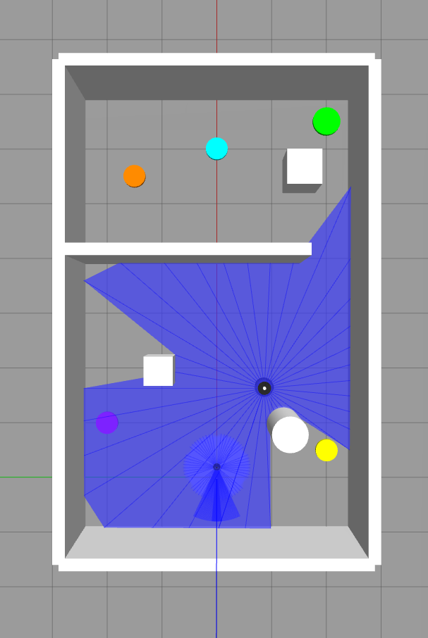
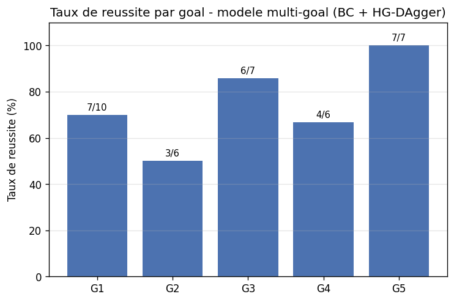
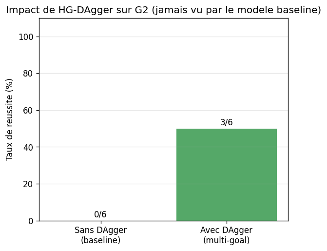

# Imitation Learning pour la Navigation Autonome — Create 3 (ROS 2 / Gazebo)

Système de navigation autonome basé sur le Behavioral Cloning (BC) et l'HG-DAgger,
développé dans le cadre d'un stage sur l'intersection robotique mobile / IA /
navigation autonome.

## Sommaire

- [Architecture](#architecture)
- [Évolution du projet : du mono-goal au multi-goal](#évolution-du-projet--du-mono-goal-au-multi-goal)
- [Méthodologie](#méthodologie)
- [Résultats](#résultats)
- [Limites connues](#limites-connues)
- [Installation et utilisation](#installation-et-utilisation)

## Architecture

- **Simulation** : Gazebo Classic 11, robot iRobot Create 3 équipé d'un LiDAR
  (36 rayons, cône avant), odométrie, IMU.
- **Observation (40D)** : 36 valeurs LiDAR normalisées + distance au goal +
  angle vers le goal + 2 dernières commandes (linéaire, angulaire).
- **Politique** : MLP (40 → 128 → 64 → 32 → 2), sortie = vitesse linéaire /
  angulaire.
- **Package ROS 2** : `create3_il`, nœuds principaux :
  - `il_data_collector` — collecte de démonstrations par téléopération
  - `bc_inference_node` — inférence autonome pure (BC)
  - `dagger_session_node` — session HG-DAgger (auto + corrections humaines)
  - `eval_trial_node` — évaluation quantitative automatisée d'un essai

## Évolution du projet : du mono-goal au multi-goal

La première version du projet entraînait le modèle BC sur un unique objectif
fixe `(5.5, 1.5)`. En changeant ce point cible sans réentraînement, le robot
échouait systématiquement (comportement dégénéré : recul + rotation en
boucle), révélant que le modèle avait appris à reconnaître la géométrie de la
pièce plutôt qu'à réellement exploiter le signal `goal_distance` /
`goal_angle` fourni en entrée — un cas typique de mémorisation plutôt que de
généralisation, propre au Behavioral Cloning pur.

Ce constat a motivé le passage à un objectif **multi-goal** : le robot doit
être capable d'atteindre **5 points cibles distincts** dans le même
environnement, en combinant :

1. Un mécanisme de **goal dynamique** (`/goal_pose`, publié à l'exécution,
   sans recompilation)
2. Une **collecte de corrections HG-DAgger** pour chaque nouveau goal
3. Un **réentraînement multi-goal** du modèle sur les données fusionnées
4. Un **filtre de sécurité réactif** (évitement d'obstacles + arrêt basé sur
   la position réelle du robot plutôt que sur l'odométrie, sujette à dérive)

## Méthodologie
### Vue d'ensemble de l'environnement multi-goal



*Les 5 objectifs dans l'environnement en L : G1 (orange), G2 (vert),
G3 (violet), G4 (bleu), G5 (jaune). Le robot est visible avec son
balayage LiDAR, positionné entre G4 et le spawn. Notez la proximité
de G2 et G4 avec des obstacles fixes, expliquant en partie leur taux
de réussite plus faible (50 % et 66.7 %) comparé à G5, proche du
spawn et dégagé (100 %).*
### Vue d'ensemble de l'environnement multi-goal


*Les 5 objectifs dans l'environnement en L : G1 (orange), G2 (vert),
G3 (violet), G4 (bleu), G5 (jaune). Le robot est visible avec son
balayage LiDAR, positionne entre G4 et le spawn. Notez la proximite
de G2 et G4 avec des obstacles fixes, expliquant en partie leur taux
de reussite plus faible (50 % et 66.7 %) compare a G5, proche du
spawn et degage (100 %).*

### Goals évalués

| Goal | Coordonnées (x, y) | Pas de démonstration / correction |
|------|--------------------|-----------------------------------|
| G1   | (5.5, 1.5)         | 15 978 (dataset original, téléopération complète) |
| G2   | (6.5, -2.0)        | 176 (HG-DAgger)  |
| G3   | (1.0, 2.0)         | 74 (HG-DAgger)   |
| G4   | (6.0, 0.0)         | 197 (HG-DAgger)  |
| G5   | (0.5, -2.0)        | 54 (HG-DAgger)   |

**Total dataset multi-goal : 16 479 pas.**

### Collecte HG-DAgger

Pour chaque nouveau goal, le modèle BC roule en autonomie ; l'opérateur reprend
la main via `teleop_twist_keyboard` (remappé sur `/cmd_vel_manual`) uniquement
lorsque le robot dérape ou se bloque. Chaque pas de correction est enregistré
`(observation, action_corrigée)` et vient enrichir le dataset d'entraînement.
Chaque session est validée après coup en vérifiant que la distance au goal
décroît de façon cohérente sur toute la trajectoire (pas de saut brutal
révélant un changement de goal accidentel en cours de session).

### Entraînement

Le modèle multi-goal est réentraîné **from scratch** (et non par
fine-tuning) sur l'ensemble fusionné G1–G5, avec une seed fixée
(reproductibilité) et un split train/validation 85/15 :


*Meilleure val_loss : 0.031 (early stopping, epoch 121/150).*

Le choix "from scratch" plutôt que "fine-tuning" a été motivé par le
risque de biais résiduel : repartir des poids du modèle G1-seul aurait
probablement transféré sa tendance à mémoriser la trajectoire vers un seul
point.

### Filtre de sécurité

Un filtre réactif (`safety_filter`), porté depuis `eval_trial_node.py` vers
les nœuds d'inférence en direct, coupe la vitesse linéaire et déclenche une
manœuvre d'évitement (rotation, puis marche arrière si blocage prolongé)
lorsqu'un obstacle est détecté à moins de 30 cm dans un cône frontal étroit.
Une phase d'**approche finale** (`final_approach_action`) prend le relais du
modèle BC dans le dernier mètre et demi avant le goal, pour un arrêt plus
précis et stable.

### Évaluation quantitative automatisée

Le script `scripts/run_evaluation.sh` automatise N essais indépendants par
goal : relance complète de Gazebo, vérification active que le
`controller_manager` répond réellement (pas seulement présence du topic),
application confirmée de `safety_override=full`, exécution d'un essai
via `eval_trial_node.py`, puis nettoyage complet (y compris redémarrage du
daemon ROS 2) avant l'essai suivant. Les essais dont l'infrastructure de
simulation n'a pas démarré correctement (spawn Gazebo, contrôleur non
disponible) sont détectés et exclus automatiquement du calcul de taux de
réussite, pour ne pas polluer les résultats avec du bruit d'infrastructure.

## Résultats

### Taux de réussite par goal (modèle multi-goal, 6 à 10 essais par goal)



| Goal | Essais valides | Réussite |
|------|-----------------|----------|
| G1   | 10 | 7/10 (70.0 %) |
| G2   | 6  | 3/6 (50.0 %)  |
| G3   | 7  | 6/7 (85.7 %)  |
| G4   | 6  | 4/6 (66.7 %)  |
| G5   | 7  | 7/7 (100.0 %) |
| **Moyenne** | **36** | **27/36 (75.0 %)** |

### Impact de HG-DAgger : baseline vs multi-goal (goal G2)



Le modèle **baseline** (`bc_model_seed42.pt`, entraîné uniquement sur G1,
jamais exposé à G2 pendant l'entraînement) échoue totalement sur G2 :

| Modèle | Essais | Réussite | Comportement observé |
|--------|--------|----------|----------------------|
| Baseline (sans DAgger) | 6 | 0/6 (0 %) | Timeout systématique, errance (15–29 m parcourus, sans collision) |
| Multi-goal (avec DAgger) | 6 | 3/6 (50 %) | Réussite dans la moitié des essais |

Ce résultat démontre l'apport mesurable de HG-DAgger pour la généralisation
à de nouveaux objectifs, même avec un volume de corrections limité
(176 pas, soit ~1 % du dataset total).

### Répartition des issues par goal


## Limites connues

- **Filtre de sécurité réactif et minima locaux** : dans les passages étroits
  (ex. goulot entre les deux salles de l'environnement), le filtre peut
  entrer en oscillation (évitement à droite / à gauche en boucle) sans
  dégager complètement l'obstacle — limite classique des approches
  purement réactives face à une planification globale (cf. comparaison
  Nav2 à venir).
- **Détection frontale uniquement** : le cône de sécurité ne couvre pas les
  collisions latérales (frôlement en virage), observées sur certains essais
  malgré `safety_triggers = 0`.
- **Déséquilibre du dataset multi-goal** : G2–G5 ne représentent que ~3 % du
  volume total face à G1. Un sur-échantillonnage ciblé de ces goals est une
  piste d'amélioration identifiée mais non encore mise en œuvre.
- **Instabilité d'infrastructure (WSL2 + Gazebo Classic)** : environ 20–30 %
  des lancements automatisés échouent au niveau du spawn / `controller_manager`
  (indépendamment du modèle), nécessitant les vérifications actives ajoutées
  au script d'évaluation et un redémarrage périodique de l'environnement WSL2.

## Installation et utilisation

Voir les scripts dans `scripts/` :
- `train_bc.py` — entraînement BC mono-goal (baseline, from scratch)
- `train_bc_multigoal.py` — entraînement multi-goal (fusion G1 + corrections DAgger)
- `run_evaluation.sh <n_essais> <goal>` — évaluation quantitative automatisée
- `summarize_evaluation.py <csv>` — résumé des résultats d'un CSV d'évaluation
- `generate_report_charts.py` — régénère les graphiques de ce README à partir
  des logs d'entraînement et des CSV de résultats

Pour changer de goal dynamiquement sans recompiler :
```bash
ros2 topic pub --once /goal_pose geometry_msgs/msg/PoseStamped \
  "{pose: {position: {x: 6.0, y: 0.0, z: 0.0}}}"
```


